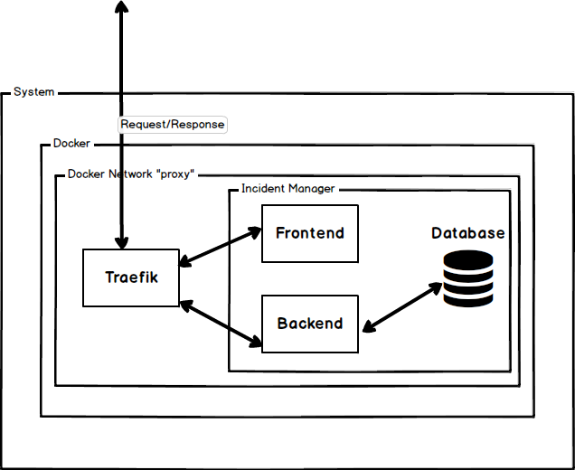

# Deployment

Just like in development the deployment of the IncidentManager is running as a set of Docker containers, composed together using `docker compose`. You can find the corresponding docker files for deployment under `/deploy`

The key difference between the development and deployment is how the containers are built. For the frontend and backend we have separate docker files that build the application to an executable and then run that executable.

Just like when working in development there needs to be an `.env` file on the same level as the `docker-compose.yml` file. The key differences in the file are the following

```diff
-RFO_STAGE=development
+RFO_STAGE=production
-RFO_DOMAIN=localhost
+RFO_DOMAIN=###HOST URL WITHOUT https://###
```

## Internal routing

For the IncidentManager to function and there to be communication between the frontend and backend we use a traefik reverse proxy that receives the requests from the client and then reroutes them to the front or backend as necessary.



## RFOBaden specifics

You can access the web interface of the NAS at: [https://portal.rfo-baden.ch:5001/](https://portal.rfo-baden.ch:5001/)
To have a console you need too SSH into the NAS. For this, you first need to be in the same network as it is protected by a Firewall. This can be done with the Barracuda VPN.
